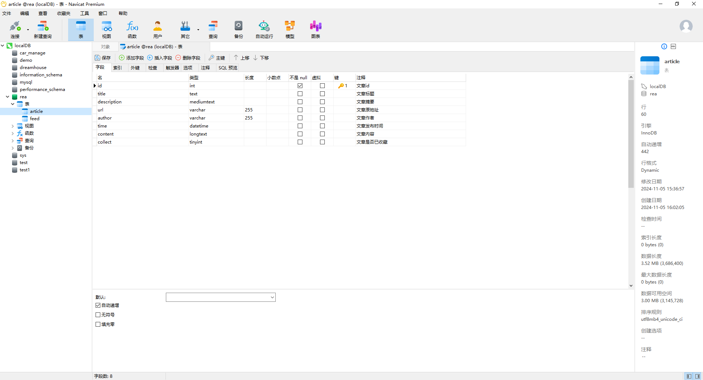

## 运行步骤

### 前端

1. 安装node、npm、vue-cli等工具

2. 进入vue_rea文件夹，执行命令`npm install`

3. 接着安装以下插件库：
   ```bash
   npm install pdfjs-dist@2.10.377
   npm install --save-dev @babel/plugin-transform-class-static-block
   npm install --save-dev @babel/plugin-transform-private-methods
   ```

4. 安装完成后执行`npm run serve`启动前端


### 后端

#### 数据库建立（之后有时间总结为sql命令）

1. 数据库建表，如下所示，主要为两张表：
   
   
   
2. 数据库修改编码(为了处理emoji存储)
   ```sql
   ALTER DATABASE rea CHARACTER SET utf8mb4 COLLATE utf8mb4_general_ai_ci;
   ALTER TABLE article CONVERT TO CHARACTER SET utf8mb4 COLLATE utf8mb4_general_ai_ci;
   ALTER TABLE feed CONVERT TO CHARACTER SET utf8mb4 COLLATE utf8mb4_general_ai_ci;
   ```


#### Spring后端运行

1. 使用maven构建工程，下载相关依赖
2. 运行RssSpringApplication


### 使用

进入vue构建之后的地址即可使用